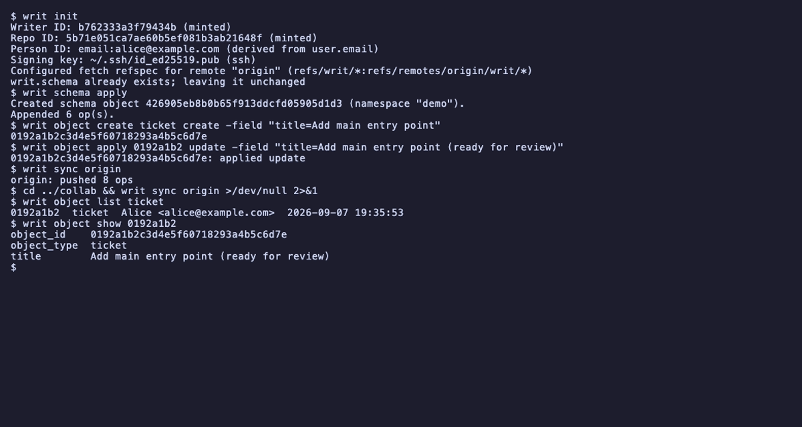

# writ
Open Source SDLC



Start with [VISION.md](VISION.md) for what this is and why, then
[ARCHITECTURE.md](ARCHITECTURE.md) for how it's built and the reasoning
behind each decision.

## Install

With Go (1.25+):

```
go install github.com/writtendev/writ/cmd/writ@latest
```

Without Go:

```
curl -fsSL https://raw.githubusercontent.com/writtendev/writ/main/install.sh | sh
```

The install script downloads the release binary for your platform, verifies
the checksum, and places it in `~/.local/bin`. Pass `--bin-dir` to choose a
different directory. No `sudo`, no PATH edits.

Verify:

```
writ version
```

writ needs every object a `refs/writ/*` op commit's ancestry names, not
just the commits: clone without `--filter` (or, in CI, leave
`actions/checkout`'s `filter:` input unset and skip its
`sparse-checkout:` input, which applies `blob:none` on its own) — a
partial clone leaves those objects missing and `writ sync` cannot
backfill them. An ordinary shallow (`--depth=...`) clone is fine; see
[Clone with full history](docs/quickstart.md#clone-with-full-history).
